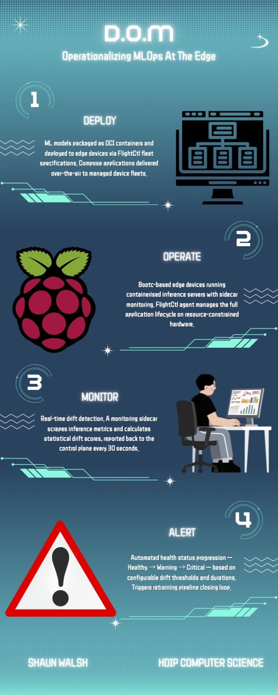

# D.O.M: Operationalising MLOps at the Edge

HDip in Computer Science - Capstone Project

  

    
    
<strong>Shaun Walsh</strong>

  

  

    <h2>About</h2>
    
This project extends FlightCtl with ML model drift monitoring for edge devices using a sidecar pattern.

    <h2>Repository</h2>
    
The main codebase is in my FlightCtl fork: <a href="https://github.com/Shaun-Walsh/flightctl/tree/wrig-1305-ml-model-monitoring">github.com/Shaun-Walsh/flightctl</a>

  

  

    
  

## Video Presentation

  <iframe src="https://www.youtube.com/embed/DXHnWAcI3I4" title="D.O.M: Operationalising MLOps at the Edge" frameborder="0" allow="accelerometer; autoplay; clipboard-write; encrypted-media; gyroscope; picture-in-picture" allowfullscreen style="position: absolute; top: 0; left: 0; width: 100%; height: 100%;"></iframe>

## Documents

- [Presentation Slides](DOM%20Presentation.pdf)
- [Final Report](Final_Report_20005831_shaunwalsh.pdf)
